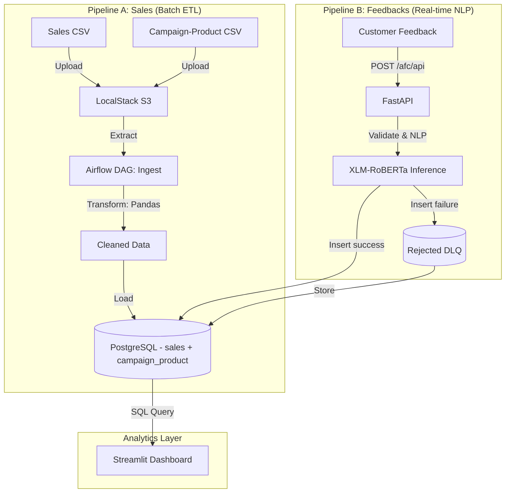

# N.D.A.I - Nugget Data & AI Initiative

**N.D.A.I** is a strategic Digital Transformation project piloted by Capgemini for its client, Armoric Fried Chicken (AFC).

Following AFC's recent global expansion, Capgemini engineered a resilient Hybrid Data Platform capable of correlating massive Global Sales Data (Batch) with Customer Sentiment (Real-time AI) to drive business decisions via an interactive dashboard.

---

## Architecture Overview

The solution implements a Hybrid Pipeline Architecture (ETL + Real-time Streaming) converging into a single PostgreSQL database to minimize infrastructure costs while maximizing agility.



### Key Technical Features
* **Unified Storage:** PostgreSQL stores all datasets relationally; JSONB columns removed for query optimization.
* **LocalStack Integration:** Simulates AWS S3 for realistic cloud-native batch workflow.
* **Multilingual NLP:** Uses **XLM-RoBERTa (Hugging Face Transformers + PyTorch)** - pretrained multilingual model supporting 100+ languages. Model loads into RAM at FastAPI startup and performs real-time inference on customer feedback.
* **Infrastructure as Code:** 100% Dockerized environment with persistent volume caching for model files.

---

## Tech Stack

| Component | Technology | Usage |
|-----------|-----------|-------|
| Language | Python 3.10+ | Core development |
| Database | PostgreSQL | Relational data store |
| Orchestration | Apache Airflow | Batch ETL scheduling (Pipeline A) |
| API | FastAPI + Uvicorn | Real-time micro-batch ingestion (Pipeline B) |
| Storage | LocalStack | AWS S3 simulation |
| Validation | Pydantic | Input validation & Dead Letter Queue |
| NLP / Sentiment | XLM-RoBERTa (HuggingFace) | Zero-shot multilingual sentiment classification |
| ML Framework | PyTorch | Deep learning inference engine |
| Visualization | Streamlit | Interactive BI dashboard |
| Containerization | Docker Compose | Full-stack deployment |

---

## Project Structure

```bash
.
├── dags/
│   └── sales_pipeline.py       # Airflow DAG for batch pipeline (sales + campaign_product)
├── data/
│   ├── raw/
│   │   ├── sales_data.csv      # Sales data source
│   │   ├── campaign_product.csv# Campaign mapping source
│   │   └── feedback_data.json  # Feedback history
│   └── processed/
│       └── cleaned_sales_data.csv # Data cleaning output
├── src/                        # Business logic (PythonOperators + API)
│   ├── __init__.py
│   ├── ingest_s3.py            # Upload data to LocalStack S3
│   ├── clean_data.py           # Data cleaning & transformation (Pandas)
│   ├── load_postgres.py        # PostgreSQL operations + SQL views
│   ├── sentiments_analysis.py # XLM-RoBERTa sentiment inference
│   └── api_feedback.py         # FastAPI micro-batch feedback service
├── start.py                    # Orchestrator script (Docker, model loading, DAG monitoring)
├── dashboard.py                # Streamlit application
├── docker-compose.yml          # Docker infrastructure
├── README.md                   # User documentation
├── README_COPILOT.md           # Technical specifications for developers
├── requirements.txt            # Python dependencies
├── logs/                       # Airflow DAG execution logs
└── localstack_data/            # LocalStack S3 simulation storage
```

## Project Status

- **Pipeline A — Batch Sales:** Fully deployed; stable DAG; tables `sales` and `campaign_product` fed daily.
- **Pipeline B — Real-time Feedbacks:** FastAPI service operational; Pydantic validation + XLM-RoBERTa NLP; live insertions into `feedbacks` and DLQ.
- **Dashboard Streamlit:** Deployed with fail-safe mechanism; queries three SQL views; provides complete BI interface.
- **Project:** 100% delivered, tested, and documented.

---

## Getting Started

### Prerequisites
* Docker & Docker Compose installed (v20.10+)
* Git
* Python 3.10+ (for local development)

### Startup Procedure

The startup process consists of 5 coordinated steps. Use the provided orchestrator script to automate this:

**Step 1: Launch Infrastructure Orchestrator**
```bash
python start.py
```
This script:
- Initializes and starts Docker containers (postgres, airflow, fastapi, localstack)
- Monitors FastAPI logs for model loading completion
- Detects the message "Traitement terminé" indicating real-time pipeline readiness
- Manages container health checks

**Step 2: Push Data to Batch Pipeline**

Once FastAPI confirms model loading, push sales data:
```bash
# Push 1000 sales records from CSV
python __main__.py PUSH 1000

# Or use the CSV source file directly
python __main__.py CSV 1000
```

**Step 3: Monitor Pipeline Readiness**

The `start.py` script automatically:
- Watches FastAPI logs for "Traitement terminé"
- Confirms all containers are healthy
- Reports when the system is ready for next steps

**Step 4: Trigger Airflow DAG**

Once data is loaded, visit `http://localhost:8081` (User/Pass: `airflow`/`airflow`) and:
- Locate the **`sales_daily_ingest`** DAG
- Click the play button to trigger manual execution
- This creates the SQL views required by the dashboard:
  - `view_sales_by_country`
  - `view_campaign_feedback_stats`
  - `view_global_kpi`

**Step 5: Launch Streamlit Dashboard**
```bash
docker-compose up -d streamlit
```
Access dashboard at `http://localhost:8501`

---

## Usage Guide

### Access Points
* **Airflow UI:** `http://localhost:8081` (airflow / airflow)
* **Streamlit Dashboard:** `http://localhost:8501`
* **FastAPI Docs:** `http://localhost:8080/docs`
* **PostgreSQL:** localhost:5432
* **LocalStack S3:** `http://localhost:4566`

### 2. Dashboard Streamlit
Le Dashboard interroge directement les trois vues SQL (`view_sales_by_country`, `view_campaign_feedback_stats`, `view_global_kpi`).

Fonctionnalités principales :
1. **Filtres dynamiques** en sidebar : plage de dates, pays, produits, recherche de campagne.
2. **KPIs globaux** mis à jour automatiquement (CA total, volume, satisfaction, nombre d'avis).
3. **Navigation par onglets** : ventes & géographie, marketing & campagnes, analyse corrélationnelle.
4. **Corrélation** : scatter plot croisant chiffre d'affaires et score de satisfaction ; zoom utilisateur et export CSV.
5. Téléchargement des données filtrées en CSV depuis chaque onglet.

### 2. Running Pipeline A (Sales Batch)
The system now ingests two CSV sources, syncing them to LocalStack S3 before transformation.
1.  Place `sales_data.csv` and `campaign_product.csv` in the `data/raw/` folder (they can be dropped by the school pusher tool directly).
2.  Trigger the **`sales_daily_ingest`** task in the Airflow DAG `sales_pipeline`.
3.  Monitor execution in the logs and verify that both `sales` and `campaign_product` tables are populated; the Streamlit dashboard will reflect the campaign linkages.

### 3. Running Pipeline B (Customer Reviews - Real-Time)
Pipeline B has been simplified into a synchronous micro-batch API; **Airflow is no longer involved**.

**Architecture:**
- **Ingestion:** Python script (`python __main__.py PUSH N`), the course tool `api_pusher`, or any HTTP client sends micro-batches of customer feedback JSON to `POST /afc/api`. The `api_pusher` tool is pre‑configured to drop CSVs in `data/raw/` and to target `http://localhost:8080/afc/api` for JSON feedbacks.
- **API Endpoint:** `POST /afc/api` performs validation and NLP in a single call.
- **Sentiment Analysis:** NLTK classification runs on the fly and returns a `sentiment_score` (1 = Positive/Neutral, 0 = Negative).
- **Fault Tolerance (DLQ):** Pydantic validates each object. Valid feedbacks are inserted into the `feedbacks` table. Invalid objects are written to `rejected_feedbacks` with a rejection reason.

**Example:** Send feedbacks via micro-batch script:
```bash
python __main__.py PUSH 5  # Push 5 feedbacks from data/raw/feedback_data.json to http://localhost:8080/afc/api
```

**Manual Test (curl):**
```bash
curl -X 'POST' \
  'http://localhost:8080/afc/api' \
  -H 'Content-Type: application/json' \
  -d '[
  {
    "username": "user_demo",
    "feedback_date": "2025-11-20",
    "campaign_id": "CAMP_DEMO",
    "comment": "The new chicken wings are fantastic!"
  }
]'
```

Responses include success count, rejection count, quality percentage, and rejection details.

---

## Data Samples

**Sales Data (CSV):**
```csv
username,sale_date,country,product,quantity,unit_price,total_amount
user149,2025-05-10,India,Chicken Nuggets,5,11.14,55.7
user914,2025-06-05,USA,Fried Wings,2,14.53,29.06
user739,2025-07-15,France,Grilled Tenders,1,8.76,8.76
```

**Reviews Data (JSON):**
```json
[
    {
        "username": "user_fb68",
        "feedback_date": "2025-04-04",
        "campaign_id": "CAMP147",
        "comment": "Great campaign!"
    },
    {
        "username": "user_fb46",
        "feedback_date": "2025-02-23",
        "campaign_id": "CAMP892",
        "comment": "Not very engaging."
    },
    {
        "username": "user_fb81",
        "feedback_date": "2025-09-21",
        "campaign_id": "CAMP274",
        "comment": "Loved the product presentation."
    }
]
```

