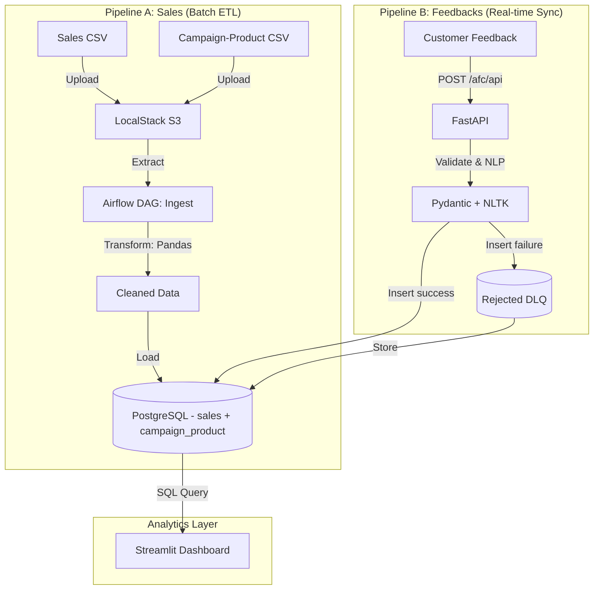

# N.D.A.I - Nugget Data & AI Initiative

**N.D.A.I** is a strategic Digital Transformation project **piloted by Capgemini** for its client, **Armoric Fried Chicken (AFC)**. 

Following AFC's recent global expansion, Capgemini was tasked to engineer a resilient **Hybrid Data Platform** capable of correlating massive **Global Sales Data** (Batch) with **Customer Sentiment** (Real-time AI) to drive business decisions via an interactive dashboard.

---

## Architecture Overview

The solution implemented by Capgemini relies on a **Hybrid Pipeline Architecture** (ETL + ELT) converging into a single PostgreSQL engine to minimize infrastructure costs while maximizing agility.



### Key Technical Features
* **Unified Storage:** PostgreSQL stores **tous** les jeux de données de manière relationnelle ; la colonne JSONB a été supprimée.
* **LocalStack Integration:** Simulates AWS S3 for a realistic cloud-native batch workflow.
* **AI-Powered:** Uses **NLTK VADER** to compute sentiment scores synchronously within the API.
* **Infrastructure as Code:** 100% Dockerized environment.

---

## Tech Stack

| Component | Technology | Usage |
| :--- | :--- | :--- |
| **Language** | Python 3.10+ | Core development |
| **Database** | PostgreSQL | Relation + Document store |
| **Orchestration** | Apache Airflow | Workflow scheduling (Pipeline A only) |
| **API** | FastAPI + Uvicorn | Real-time micro-batch ingestion (Pipeline B) |
| **Storage** | LocalStack | AWS S3 simulation for batch files |
| **Validation** | Pydantic | Input validation & Dead Letter Queue |
| **NLP / Sentiment** | NLTK | Binary sentiment classification |
| **Visualization** | Streamlit | Interactive BI Dashboard |
| **Containerization** | Docker Compose | Full stack deployment |

---

## Project Structure

```bash
.
├── dags/
│   └── sales_pipeline.py       # DAG Airflow orchestrant la pipeline batch (sales + campaign_product)
├── data/
│   ├── raw/
│   │   ├── sales_data.csv      # Sales data source
│   │   ├── campaign_product.csv# Campaign mapping source
│   │   └── feedback_data.json  # Historique d'avis
│   └── processed/
│       └── cleaned_sales_data.csv # Output du nettoyage
├── src/                        # Logique métier Python (PythonOperators + API)
│   ├── __init__.py
│   ├── ingest_s3.py            # Upload des données vers LocalStack S3
│   ├── clean_data.py           # Nettoyage & transformation (Pandas)
│   ├── load_postgres.py        # PostgreSQL insert/update + vues
│   └── api_feedback.py         # FastAPI micro‑batch feedback service
├── dashboard.py                # Application Streamlit
├── explore_data.ipynb          # Data exploration notebook
├── docker-compose.yml          # Docker infrastructure
├── README.md                   # User documentation
├── README_COPILOT.md           # Technical specifications
├── requirements.txt            # Python dependencies
├── logs/                       # Airflow DAG execution logs
└── localstack_data/            # LocalStack S3 simulation storage
```

## État d'avancement

- **Pipeline A — Batch Sales :** complètement déployée; DAG stable; tables `sales` et `campaign_product` alimentées quotidiennement.
- **Pipeline B — Feedbacks Temps‑Réel :** service FastAPI opérationnel, validations Pydantic + NLP, insertions dans `feedbacks` et DLQ en live.
- **Dashboard Streamlit :** déployé, interrogeant les trois vues SQL, fournissant une interface BI complète.
- **Projet :** 100 % livré, testé et documenté.

---

## Getting Started

### Prerequisites
* Docker & Docker Compose installed.
* Git.

### Installation

1.  **Clone the repository**
    ```bash
    git clone [https://github.com/your-username/NDAI-project.git](https://github.com/your-username/NDAI-project.git)
    cd NDAI-project
    ```

2.  **Environment Setup**
    Configuration values are read via `os.getenv` with sensible defaults. No `.env` file is required; parameters can be overridden directly in the `docker-compose.yml` or passed as environment variables.

3.  **Start the Infrastructure**
    ```bash
    docker-compose up -d --build
    ```
    *This will spin up Postgres, Airflow (Webserver/Scheduler), FastAPI, Streamlit, and LocalStack.*

---

## Usage Guide

### 1. Access Points
* **Airflow UI:** `http://localhost:8081` (User/Pass: `airflow`/`airflow`)
* **Streamlit Dashboard:** `http://localhost:8501` (lancez via `streamlit run dashboard.py`)
* **FastAPI Docs:** `http://localhost:8080/docs`
* **PostgreSQL:** Port `5432`

### 2. Dashboard Streamlit
Le Dashboard interroge directement les trois vues SQL (`view_sales_by_country`, `view_campaign_feedback_stats`, `view_global_kpi`).

Fonctionnalités principales :
1. **Filtres dynamiques** en sidebar : plage de dates, pays, produits, recherche de campagne.
2. **KPIs globaux** mis à jour automatiquement (CA total, volume, satisfaction, nombre d'avis).
3. **Navigation par onglets** : ventes & géographie, marketing & campagnes, analyse corrélationnelle.
4. **Corrélation** : scatter plot croisant chiffre d'affaires et score de satisfaction ; zoom utilisateur et export CSV.
5. Téléchargement des données filtrées en CSV depuis chaque onglet.

### 2. Running Pipeline A (Sales Batch)
The system now ingests two CSV sources, syncing them to LocalStack S3 before transformation.
1.  Place `sales_data.csv` and `campaign_product.csv` in the `data/raw/` folder (they can be dropped by the school pusher tool directly).
2.  Trigger the **`sales_daily_ingest`** task in the Airflow DAG `sales_pipeline`.
3.  Monitor execution in the logs and verify that both `sales` and `campaign_product` tables are populated; the Streamlit dashboard will reflect the campaign linkages.

### 3. Running Pipeline B (Customer Reviews - Real-Time)
Pipeline B has been simplified into a synchronous micro-batch API; **Airflow is no longer involved**.

**Architecture:**
- **Ingestion:** Python script (`python __main__.py PUSH N`), the course tool `api_pusher`, or any HTTP client sends micro-batches of customer feedback JSON to `POST /afc/api`. The `api_pusher` tool is pre‑configured to drop CSVs in `data/raw/` and to target `http://localhost:8080/afc/api` for JSON feedbacks.
- **API Endpoint:** `POST /afc/api` performs validation and NLP in a single call.
- **Sentiment Analysis:** NLTK classification runs on the fly and returns a `sentiment_score` (1 = Positive/Neutral, 0 = Negative).
- **Fault Tolerance (DLQ):** Pydantic validates each object. Valid feedbacks are inserted into the `feedbacks` table. Invalid objects are written to `rejected_feedbacks` with a rejection reason.

**Example:** Send feedbacks via micro-batch script:
```bash
python __main__.py PUSH 5  # Push 5 feedbacks from data/raw/feedback_data.json to http://localhost:8080/afc/api
```

**Manual Test (curl):**
```bash
curl -X 'POST' \
  'http://localhost:8080/afc/api' \
  -H 'Content-Type: application/json' \
  -d '[
  {
    "username": "user_demo",
    "feedback_date": "2025-11-20",
    "campaign_id": "CAMP_DEMO",
    "comment": "The new chicken wings are fantastic!"
  }
]'
```

Responses include success count, rejection count, quality percentage, and rejection details.

---

## Data Samples

**Sales Data (CSV):**
```csv
username,sale_date,country,product,quantity,unit_price,total_amount
user149,2025-05-10,India,Chicken Nuggets,5,11.14,55.7
user914,2025-06-05,USA,Fried Wings,2,14.53,29.06
user739,2025-07-15,France,Grilled Tenders,1,8.76,8.76
```

**Reviews Data (JSON):**
```json
[
    {
        "username": "user_fb68",
        "feedback_date": "2025-04-04",
        "campaign_id": "CAMP147",
        "comment": "Great campaign!"
    },
    {
        "username": "user_fb46",
        "feedback_date": "2025-02-23",
        "campaign_id": "CAMP892",
        "comment": "Not very engaging."
    },
    {
        "username": "user_fb81",
        "feedback_date": "2025-09-21",
        "campaign_id": "CAMP274",
        "comment": "Loved the product presentation."
    }
]
```

