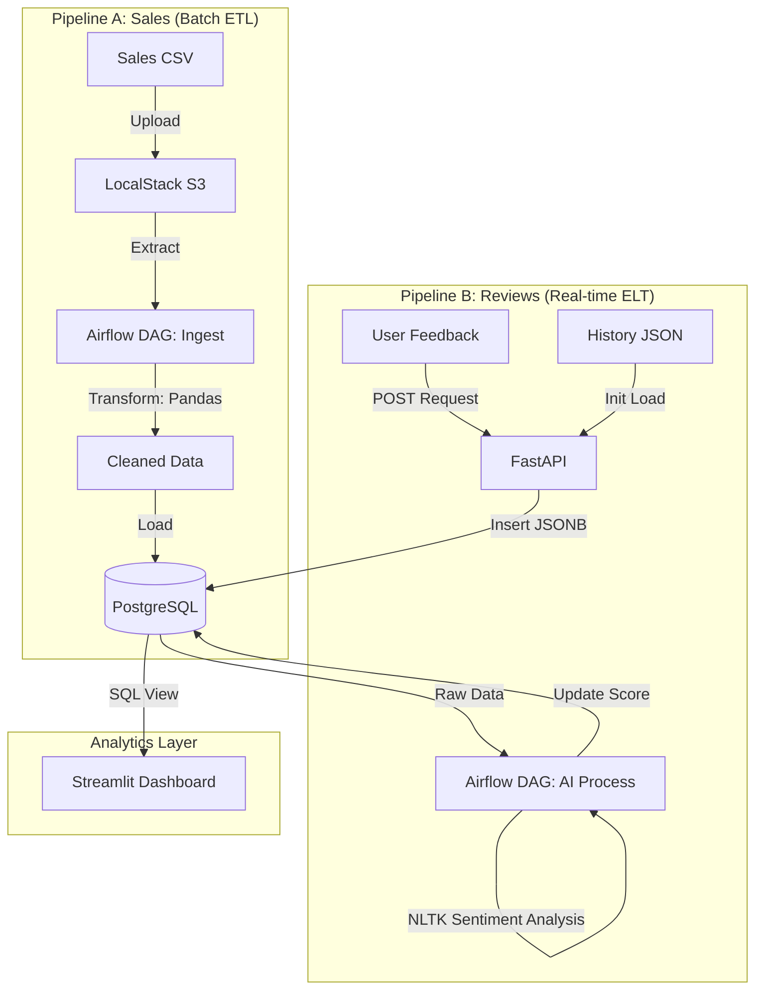

# 🍗 N.D.A.I - Nugget Data & AI Initiative


**N.D.A.I** is a strategic Digital Transformation project **piloted by Capgemini** for its client, **Armoric Fried Chicken (AFC)**. 

Following AFC's recent global expansion, Capgemini was tasked to engineer a resilient **Hybrid Data Platform** capable of correlating massive **Global Sales Data** (Batch) with **Customer Sentiment** (Real-time AI) to drive business decisions via an interactive dashboard.

---

## 🏗️ Architecture Overview

The solution implemented by Capgemini relies on a **Hybrid Pipeline Architecture** (ETL + ELT) converging into a single PostgreSQL engine to minimize infrastructure costs while maximizing agility.



### Key Technical Features
* **Unified Storage:** PostgreSQL handles both structured relational data (`Sales`) and semi-structured data (`Reviews` as **JSONB**).
* **LocalStack Integration:** Simulates AWS S3 for a realistic cloud-native batch workflow.
* **AI-Powered:** Uses **NLTK VADER** to compute sentiment scores from raw text asynchronously.
* **Infrastructure as Code:** 100% Dockerized environment.

---

## 🛠️ Tech Stack

| Component | Technology | Usage |
| :--- | :--- | :--- |
| **Language** | Python 3.10+ | Core development |
| **Database** | PostgreSQL | Relation + Document store |
| **Orchestration** | Apache Airflow | Workflow scheduling & dependency management |
| **API** | FastAPI | Real-time data ingestion endpoint |
| **Storage** | LocalStack | AWS S3 simulation for batch files |
| **AI / NLP** | NLTK | Sentiment analysis processing |
| **Visualization** | Streamlit | Interactive BI Dashboard |
| **Containerization** | Docker Compose | Full stack deployment |

---

## 📂 Project Structure

```bash
.
├── dags/
│   └── sales_pipeline.py       # DAG Airflow orchestrant la pipeline batch
├── data/
│   ├── raw/                    # Données brutes (ex: sales_data.csv)
│   └── processed/              # Données nettoyées prêtes pour la BDD
├── src/                        # Logique métier Python (PythonOperators)
│   ├── ingest_s3.py            # Upload des données vers LocalStack S3
│   ├── clean_data.py           # Nettoyage Pandas (Dédoublonnage, typage)
│   └── load_postgres.py        # Insertion idempotente dans PostgreSQL
├── docker-compose.yml          # Infrastructure locale (Airflow, Postgres, LocalStack)
└── requirements.txt            # Dépendances Python
```

## 📈 État d'avancement

- **Étape 1 — Pipeline Batch:** ✅ Fait — Ingestion S3, Orchestration Airflow, Nettoyage Pandas, Chargement idempotent dans PostgreSQL (TRUNCATE + INSERT).
- **Étape 2 — Pipeline Reviews (Temps réel/API/Kafka):** ⏳ À venir
- **Étape 3 — Dashboard / Streamlit:** ⏳ À venir

---

## 🚀 Getting Started

### Prerequisites
* Docker & Docker Compose installed.
* Git.

### Installation

1.  **Clone the repository**
    ```bash
    git clone [https://github.com/your-username/NDAI-project.git](https://github.com/your-username/NDAI-project.git)
    cd NDAI-project
    ```

2.  **Environment Setup**
    Create a `.env` file based on the example (or use default values in docker-compose):
    ```bash
    cp .env.example .env
    ```

3.  **Start the Infrastructure**
    ```bash
    docker-compose up -d --build
    ```
    *This will spin up Postgres, Airflow (Webserver/Scheduler), FastAPI, Streamlit, and LocalStack.*

---

## 🖥️ Usage Guide

### 1. Access Points
* **Airflow UI:** `http://localhost:8080` (User/Pass: `airflow`/`airflow`)
* **Streamlit Dashboard:** `http://localhost:8501`
* **FastAPI Docs:** `http://localhost:8000/docs`
* **PostgreSQL:** Port `5432`

### 2. Running Pipeline A (Sales Batch)
The system simulates an S3 upload via LocalStack.
1.  Ensure `sales_data.csv` is in `data/raw/` folder.
2.  Trigger the **`sales_daily_ingest`** task in the Airflow DAG `sales_pipeline`.
3.  Monitor execution in the logs and check Streamlit dashboard for results.

### 3. Running Pipeline B (Reviews AI)
**Option A: Load History**
The system automatically loads `feedback_data.json` from `data/raw/` via the FastAPI initialization script.

**Option B: Real-time Ingestion**
Send a POST request to the FastAPI endpoint:
```bash
curl -X 'POST' \
  'http://localhost:8000/feedback/' \
  -H 'Content-Type: application/json' \
  -d '{
  "username": "user_demo",
  "feedback_date": "2025-11-20",
  "campaign_id": "CAMP_DEMO",
  "comment": "The new chicken wings are fantastic!"
}'
```
Wait for the **`reviews_ai_processing`** task in `sales_pipeline` DAG to run (scheduled every 30 mins) or trigger it manually. The NLTK VADER sentiment analysis will update the Sentiment Score column.

---

## 📊 Data Samples

**Sales Data (CSV):**
```csv
username,sale_date,country,product,quantity,unit_price,total_amount
user149,2025-05-10,India,Chicken Nuggets,5,11.14,55.7
user914,2025-06-05,USA,Fried Wings,2,14.53,29.06
user739,2025-07-15,France,Grilled Tenders,1,8.76,8.76
```

**Reviews Data (JSON):**
```json
[
    {
        "username": "user_fb68",
        "feedback_date": "2025-04-04",
        "campaign_id": "CAMP147",
        "comment": "Great campaign!"
    },
    {
        "username": "user_fb46",
        "feedback_date": "2025-02-23",
        "campaign_id": "CAMP892",
        "comment": "Not very engaging."
    },
    {
        "username": "user_fb81",
        "feedback_date": "2025-09-21",
        "campaign_id": "CAMP274",
        "comment": "Loved the product presentation."
    }
]
```

---

## 👤 Author

**[Adel ZAIRI]** 

*Project delivered for Capgemini.*